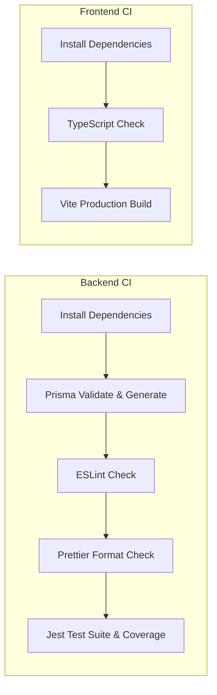

# Botway — Developer Onboarding & CI/CD Guide

Welcome to the **Botway** engineering team! This guide explains how to set up your local development environment, run test suites, and follow our automated CI/CD pipeline.

---

## 🏗️ Architecture Overview

- **`botway-core/`**: Node.js + Express + Prisma Core Backend (port `8000`)
- **`frontend/`**: React + TypeScript + Vite + Tailwind CSS Frontend (port `5173`)
- **`supabase/`**: PostgreSQL database migrations & RLS policies
- **`.github/workflows/`**: Automated CI/CD pipelines

---

## 🚀 Quick Start (Local Setup)

### 1. Prerequisites
- **Node.js**: `v20.x` or `v22.x`
- **npm**: `v9.x` or higher
- **Git**

### 2. Clone the Repository
```bash
git clone https://github.com/<your-org>/Botway.git
cd Botway
```

---

## 🛠️ Setting Up `botway-core` (Backend)

```bash
cd botway-core

# 1. Install dependencies
npm install

# 2. Setup Environment Variables
cp .env.example .env
# Edit .env and supply your Supabase and Database connection keys

# 3. Validate Prisma Schema & Generate Client
npm run prisma:validate
npm run prisma:generate

# 4. Run automated test suite
npm test

# 5. Start Development Server (with hot reloading)
npm run dev
```
Backend will be live at:
- **API Base**: `http://localhost:8000/api/v1`
- **Health check**: `http://localhost:8000/api/v1/health`
- **Interactive Swagger Docs**: `http://localhost:8000/api/docs`

---

## 🎨 Setting Up `frontend` (React + Vite)

```bash
cd ../frontend

# 1. Install dependencies
npm install

# 2. Setup Environment Variables
cp .env.example .env
# Ensure VITE_SUPABASE_URL and VITE_SUPABASE_PUBLISHABLE_KEY are filled

# 3. Run TypeCheck & Build
npm run build

# 4. Start Development Server
npm run dev
```
Frontend will be live at: `http://localhost:5173`

---

## 🔄 CI/CD Pipeline (GitHub Actions)

Every pull request and push to `main` or `develop` triggers our automated CI pipeline defined in [`.github/workflows/ci.yml`](.github/workflows/ci.yml).

### Automated Pipeline Checks:



### Pre-Commit Checklist for Developers:

Before opening a Pull Request, run these commands locally to ensure CI passes:

```bash
# In botway-core/
npm run lint:fix
npm run format
npm run prisma:validate
npm test

# In frontend/
npm run build
```

---

## 📦 Deployment (CD)

- **Backend (`botway-core`)**: Deploys to **Railway** on push to `main`.
  - Start command: `npm run start:prod`
  - Health check endpoint: `/api/v1/health`
- **Frontend (`frontend`)**: Deploys to **Vercel** / **Netlify** on push to `main`.
