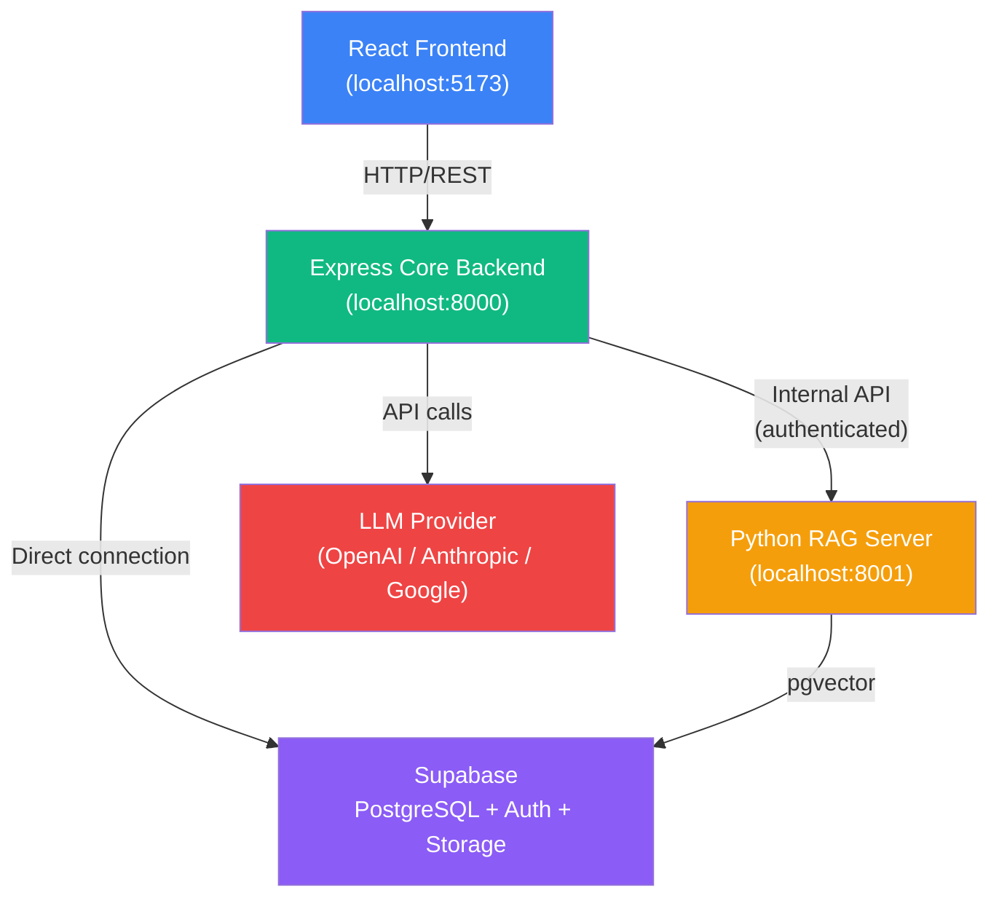
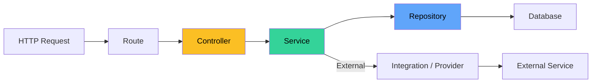
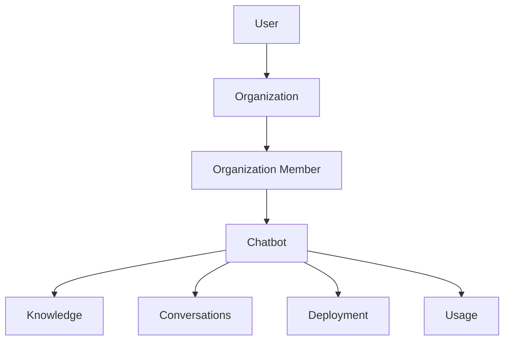
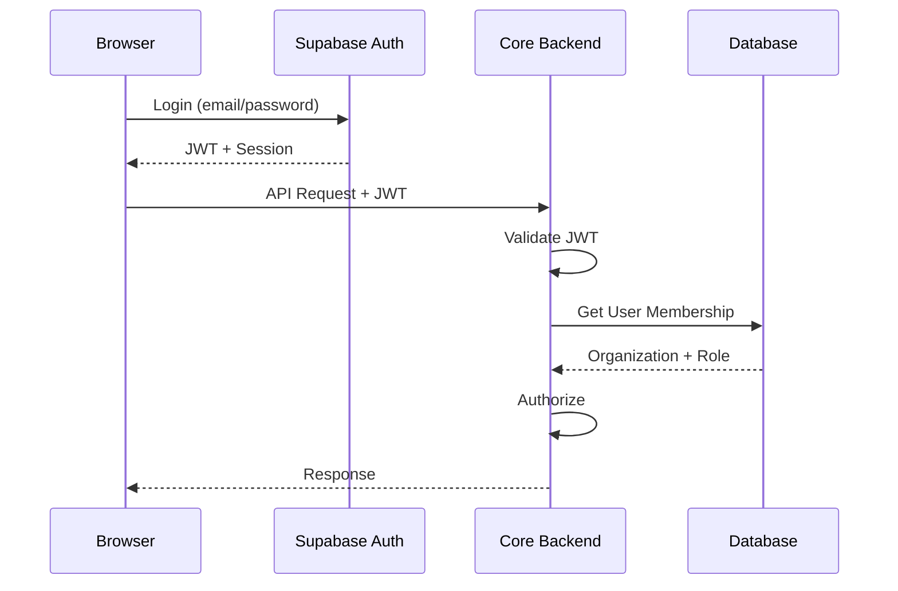

# Botway Core Architecture

## System Overview

Botway is a multi-tenant SaaS AI chatbot platform. The architecture is split into two backend services:

1. **Express Core Backend** (`botway-core`) — application/business layer
2. **Python RAG Server** (future) — heavy document processing and retrieval



> **Important**: The browser MUST NEVER communicate directly with the RAG server. All RAG operations go through the Core Backend.

---

## Responsibility Split

### Core Backend (Express)

| Domain | Responsibilities |
|--------|-----------------|
| **Auth** | JWT validation, session management, Supabase Auth integration |
| **Users** | Profile CRUD, avatar management |
| **Organizations** | Tenant CRUD, member management, tenant isolation |
| **Chatbots** | CRUD, configuration, behavior, appearance, system prompt orchestration |
| **Knowledge** | Metadata management, orchestrating ingestion via RAG server |
| **Conversations** | Session management, message storage, chat history |
| **Deployments** | Widget config, embed code, public chatbot API |
| **Usage** | Message/token/API call tracking, analytics |
| **Billing** | Subscriptions, plan limits, payments |

### RAG Server (Python/FastAPI — Future)

| Domain | Responsibilities |
|--------|-----------------|
| **Ingestion** | PDF extraction, document parsing |
| **Processing** | Chunking, text splitting |
| **Embeddings** | Vector generation via embedding models |
| **Indexing** | pgvector storage and management |
| **Retrieval** | Vector search, reranking |
| **RAG** | Context assembly for LLM |

---

## Request Flow



### Rules

- **Controllers** are thin — extract input, call service, return response
- **Services** contain business logic, orchestrate repos + integrations
- **Repositories** handle database operations via Prisma
- **Integrations** handle external service communication

---

## Multi-Tenancy



Every organization-owned resource is scoped to an organization. The backend derives organization access from authenticated membership — never from frontend-supplied `organization_id`.

---

## Future Authentication Flow



---

## Future Chatbot Structure

```
Chatbot
├── Basic information (name, description)
├── Business description
├── System prompt (AI-generated + user-edited)
├── Behavior (tone, rules, restrictions)
├── Appearance (colors, avatar, widget style)
├── Knowledge configuration (connected sources)
├── Deployment configuration (domains, widget embed)
└── Usage (message counts, token usage)
```
